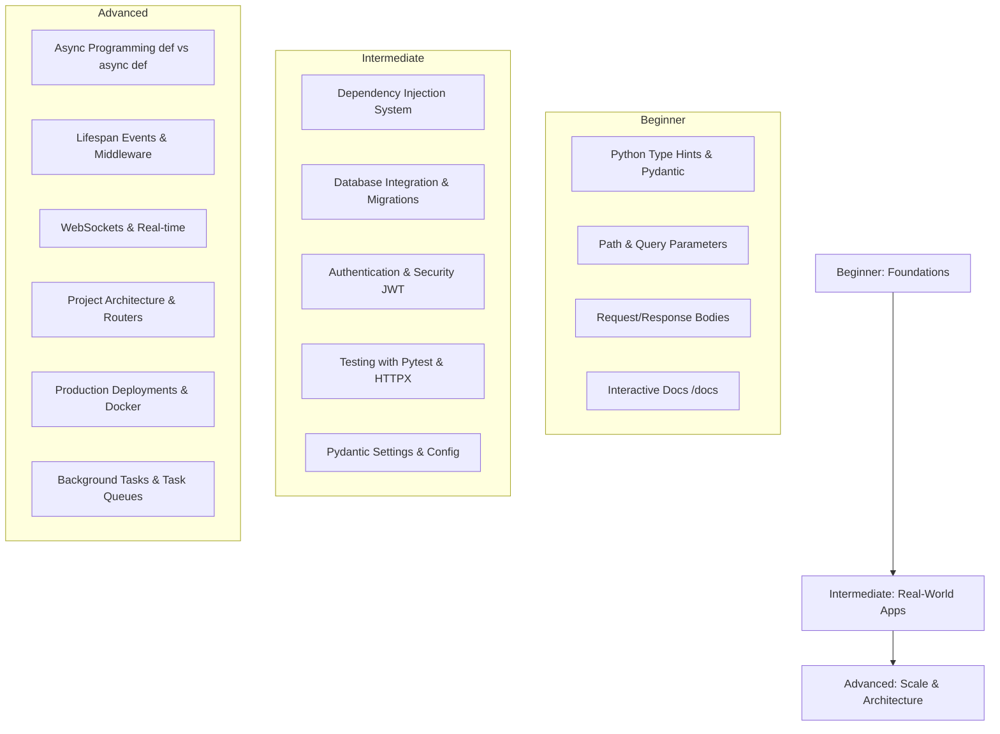

# 🚀 The Ultimate FastAPI Roadmap: Beginner to Advanced

Welcome to your roadmap for mastering **FastAPI**! FastAPI is one of the fastest, most modern, and most popular Python web frameworks today. To go from a beginner to an advanced developer, you need to master not just the framework's syntax, but also its underlying concepts (like Asynchronous Python, Pydantic, and Starlette), architecture, security, database integration, and production deployment.

This roadmap is divided into three distinct phases: **Beginner (The Foundations)**, **Intermediate (Building Real-World Apps)**, and **Advanced (Scaling & Production-Grade Architecture)**.

---

## 🗺️ Roadmap at a Glance



---

## 🟩 Phase 1: Beginner (The Foundations)

In this phase, you build a solid understanding of how FastAPI receives, validates, and sends data.

### 1. Python Type Hints (PEP 484)
FastAPI relies entirely on standard Python type hints. Without a strong grasp of types, FastAPI's magic won't work.
- **What to know:** `int`, `str`, `float`, `bool`, `list`, `dict`, `set`, and the `typing` module (`List`, `Dict`, `Union`, `Optional`).
- **Modern Python (3.10+):** Use `list[str]` instead of `List[str]`, and `str | None` instead of `Optional[str]`.
- **Why it matters:** Types enable FastAPI to do automatic data validation, serialization, and interactive documentation.

### 2. Pydantic v2 (Data Validation & Serialization)
Pydantic is the validation engine under the hood of FastAPI.
- **`BaseModel`:** How to define request body schemas.
- **`Field`:** Specifying validations (e.g., min/max length, regex, defaults, descriptions).
- **Serialization:** How Pydantic converts Python objects (like database models) into JSON objects.
- **Example:**
  ```python
  from pydantic import BaseModel, Field, EmailStr

  class UserCreate(BaseModel):
      username: str = Field(..., min_length=3, max_length=50)
      email: EmailStr
      age: int | None = Field(default=None, ge=18)
  ```

### 3. Path & Query Parameters
- **Path Parameters:** Extract variables from the URL path (e.g., `/items/{item_id}`).
- **Query Parameters:** Query string parameters at the end of the URL (e.g., `/items?limit=10&offset=0`).
- **Validation:** Using `Path` and `Query` from `fastapi` to add validation constraints directly to parameters.

### 4. Interactive Documentation
FastAPI automatically generates documentation. You should know how to document your API like a pro:
- **Swagger UI** (`/docs`) and **ReDoc** (`/redoc`).
- Adding metadata: `title`, `description`, `version`.
- Tagging routes (`tags=["users"]`) to organize the UI.
- Adding route docstrings (these show up as descriptions in the docs).

---

## 🟨 Phase 2: Intermediate (Building Real-World Apps)

Here, you transition from simple endpoints to building structure, security, and persistence into your applications.

### 1. The Dependency Injection (DI) System 🔑
FastAPI's Dependency Injection system is its most powerful feature. It allows you to write modular, testable, and reusable code.
- **What is `Depends`?** Declaring components that your endpoints need before executing (e.g., DB session, authenticated user).
- **Yield Dependencies:** Managing resources that need setup and teardown (e.g., opening and closing database sessions).
- **Class-based Dependencies:** Storing state or configuration in dependencies.
- **Example (DB session dependency):**
  ```python
  from fastapi import Depends
  
  def get_db():
      db = SessionLocal()
      try:
          yield db
      finally:
          db.close()

  @app.get("/items/")
  def read_items(db = Depends(get_db)):
      return db.query(Item).all()
  ```

### 2. Database Integration & Alembic
You must understand how to connect FastAPI to SQL databases.
- **ORM libraries:** SQLAlchemy 2.0 (modern 2.0 style) or SQLModel (a wrapper combining SQLAlchemy and Pydantic).
- **Migrations:** Setting up **Alembic** to track database schema changes.
- **Async vs. Sync Drivers:** Understanding async database drivers (`asyncpg` for PostgreSQL) vs. sync drivers (`psycopg2`).

### 3. Authentication & JWT Security
Securing your API endpoints is a core intermediate skill.
- **OAuth2 Password Flow:** The standard flow for logging in and getting tokens.
- **JWT (JSON Web Tokens):** How to generate, sign, and verify tokens (`pyjwt` or `python-jose`).
- **Password Hashing:** Storing passwords securely (`passlib` with `bcrypt`).
- **Role-based access control:** Checking if a user has admin rights using dependencies.

### 4. Environment & Settings Management
Never hardcode secrets!
- **Pydantic Settings (`pydantic-settings`):** Read settings from environment variables and `.env` files with validation.
- **Config Inheritance:** Creating a base settings configuration class.

### 5. Testing with Pytest & HTTPX
Testing ensures your API continues to work as it grows.
- **`TestClient`:** Standard testing client built on Starlette.
- **`AsyncClient` from HTTPX:** Testing async endpoints.
- **Dependency Overrides:** Mocking external APIs or databases during tests using `app.dependency_overrides`.

---

## 🟥 Phase 3: Advanced (Scaling & Production-Grade Architecture)

This phase turns you into an architect capable of building high-performance, distributed, and scalable APIs.

### 1. Concurrency: `def` vs `async def` ⚡
Knowing when to use async vs sync functions is critical to FastAPI performance.
- **Event Loop:** How single-threaded concurrency works in Python.
- **`async def` (IO-Bound):** Use for database queries, third-party API calls, and reading/writing files. Always `await` non-blocking operations.
- **`def` (CPU-Bound or Sync-blocking):** If you use a blocking library (like standard requests or a sync database driver) inside `async def`, you block the event loop. FastAPI runs normal `def` functions in a separate thread pool to prevent blocking.
- **Background Tasks:** Using FastAPI's built-in `BackgroundTasks` for lightweight operations post-response (e.g., sending an email).

### 2. Lifespan Events & Custom Middleware
- **Lifespan Context Manager:** Performing startup logic (connecting to database/Redis, loading AI models) and shutdown logic (disconnecting) cleanly using `@asynccontextmanager`.
- **Middleware:** Executing logic before a request reaches a route and after a response leaves it (e.g., CORS, custom logging, tracking request durations).

### 3. Large Project Structure (APIRouter)
Monolithic files are hard to maintain. You must learn how to organize code.
- **Modular Routing:** Using `APIRouter` to split endpoints into functional domains (e.g., `users.py`, `auth.py`, `items.py`).
- **Clean Architecture / Repository Pattern:** Decoupling your controllers (routers) from your business logic and database access layer.
- **Recommended Project Structure:**
  ```text
  app/
  ├── api/
  │   ├── v1/
  │   │   ├── endpoints/
  │   │   │   ├── auth.py
  │   │   │   └── users.py
  │   │   └── api.py          # Includes routers
  ├── core/
  │   ├── config.py           # Settings
  │   ├── security.py         # JWT tokens, password hashing
  │   └── database.py         # DB connection setup
  ├── models/                 # SQLAlchemy ORM models
  ├── schemas/                # Pydantic schemas
  ├── services/               # Business logic
  ├── main.py                 # FastAPI application initialization
  ```

### 4. Advanced Performance & Optimization
- **Caching:** Integrating **Redis** to cache database-intensive responses.
- **Rate Limiting:** Protecting endpoints from abuse using `slowapi` or Redis-based rate limiters.
- **Connection Pools:** Keeping database connections open to reuse them, reducing connection overhead.

### 5. WebSockets & Server-Sent Events (SSE)
- **WebSockets:** Real-time, bi-directional communication (e.g., chat applications, live notifications).
- **SSE:** One-way real-time data streaming (e.g., live stock feeds, progress bar updates).

### 6. Production Deployment & Monitoring 🐳
Getting your application to run reliably in the cloud.
- **ASGI Servers:** Running FastAPI behind **Uvicorn** or **Gunicorn** with Uvicorn worker class.
- **Dockerization:** Creating efficient, multi-stage Dockerfiles.
- **Structured Logging:** Implementing `structlog` for JSON logging, which makes it easy for log collectors to parse.
- **Observability:** Setting up **Prometheus** (metrics), **Sentry** (error reporting), and **OpenTelemetry** (tracing).

---

## 📈 Suggested Learning Path (Action Plan)

1. **Week 1-2: Foundations**
   - Refactor your current Hello World program. Create some Pydantic schemas and endpoints that accept user input and return validated data.
2. **Week 3-4: The Database & DI**
   - Connect FastAPI to a local SQLite or PostgreSQL database using **SQLAlchemy 2.0**.
   - Create a dependency `get_db` to yield session sessions.
3. **Week 5-6: Security & Auth**
   - Build a registration and login flow. Return a JWT token and secure other routes so only logged-in users can access them.
4. **Week 7-8: Testing & Architecture**
   - Re-organize your files into the recommended modular structure.
   - Write tests for your routes using `pytest` and `HTTPX TestClient`, mocking the database.
5. **Beyond: Async, Caching & Docker**
   - Move database queries to an async driver (like `asyncpg` or `SQLModel` with async sessions).
   - Containerize your application using Docker and run it locally.
